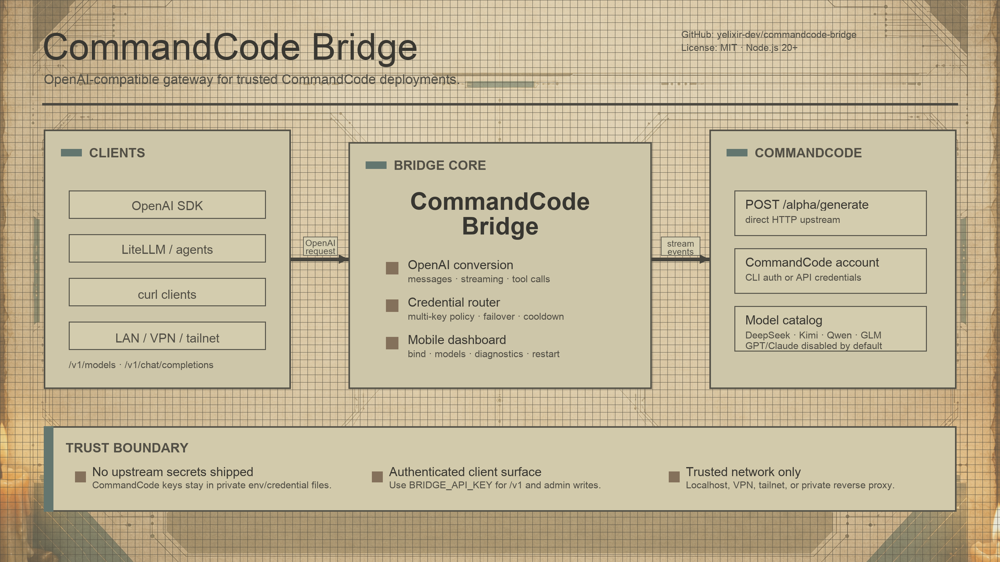

<p align="right">
  🌐 <a href="README.md">English</a> · <a href="README.ko.md">한국어</a> · 中文
</p>

# CommandCode Bridge

<p align="center">
  
</p>

<p align="center">
  <strong>面向可信环境的 CommandCode OpenAI-compatible 网关。</strong>
</p>

<p align="center">
  <a href=".github/workflows/ci.yml"></a>
  <a href="LICENSE"></a>
  
  
</p>

CommandCode Bridge 是一个用于可信环境的 HTTP bridge，可把 CommandCode 账号暴露为小型 OpenAI-compatible API。局域网、VPN、tailnet 或本机客户端可以通过标准 `/v1/models` 和 `/v1/chat/completions` 端点调用 CommandCode-backed 模型。

> **需要 CommandCode。** 本项目不是公开的独立 DeepSeek 代理，也不包含或重新打包 CommandCode CLI bundle。你需要官方 CommandCode CLI/account 环境（`command-code` npm package 提供的 `cmd`）或等价的 CommandCode API credential。请从官方页面安装并认证 CommandCode：<https://commandcode.ai/install>。

> **状态。** 这是内部/可信环境用 bridge。上游 CommandCode `/alpha/generate` 路径具有 alpha/internal API 特征，未来可能变化。

## 一览

| 领域     | 摘要                                                                                                                  |
| -------- | --------------------------------------------------------------------------------------------------------------------- |
| API 表面 | `/health`、`/dashboard`、`/v1/models`、`/v1/chat/completions` 和 redacted admin diagnostics。                         |
| 核心价值 | OpenAI-compatible 客户端无需每次请求都启动 `cmd`，即可使用 CommandCode-backed 模型。                                  |
| 路由     | 基于 daily-burn、balance-priority、round-robin、drain-first 的 multi-key credential 选择。                            |
| 运维     | 移动优先 dashboard，支持 bind、routing、credential、model toggle、diagnostics、save、restart，以及中文/韩文/英文 UI。 |
| 安全边界 | 不捆绑上游 secret；只应在 localhost、可信 VPN/tailnet 或私有反向代理后暴露。                                          |

安装后的 one-shot smoke test：

```bash
BRIDGE=http://127.0.0.1:9992; \
curl -fsS "$BRIDGE/health" && echo && \
curl -fsS "$BRIDGE/v1/models" | head -c 400
```

健康 bridge 会返回 JSON health/version 信息和非空的 OpenAI-compatible model list。只有在确认 CommandCode 账号有可用 credit 后，才运行真实 chat completion。

## 这个 bridge 提供什么

- 提供 OpenAI-compatible 端点：
  - `GET /health`
  - `GET /dashboard`
  - `GET /v1/models`
  - `POST /v1/chat/completions`
  - `GET /admin/config` 和 `GET /admin/commandcode/credentials`，用于 redacted read-only dashboard state
  - `PUT /admin/config` 和 `POST /admin/restart`，用于 authenticated dashboard writes/restart
- 将 CommandCode streaming events 转换为 OpenAI chat completion 响应或 SSE chunks。
- 同时支持 non-streaming 和 streaming OpenAI clients，包括 `stream_options.include_usage` usage chunks。
- 支持 CommandCode 发出的 tool calls，并映射回 OpenAI `tool_calls`。
- 支持 `developer`、`system`、`user`、`assistant`、`tool` messages。
- 默认隐藏 reasoning deltas（`INCLUDE_REASONING=false`）。
- 对没有可见输出且 `finish_reason: length` 的响应默认 fail closed，而不是返回空白 success。
- 可以从 CLI auth file、单 API key、multi-key env var 或 JSON credentials file 加载 CommandCode upstream credentials。
- 包含 multi-key credential router，可安全轮换多个 CommandCode keys。
- 包含移动优先 `/dashboard`，用于 server bind、routing policy、key 管理、model toggles、diagnostics、JSON save、restart，以及中文/韩文/英文 localization。
- 包含可选 balance alerts 和可选 `commandcode-router` 进程，用于跨多个 bridge hosts 路由。

## 版本

当前 bridge version：**v0.32.3**。

版本也会从 `/health` 返回，并显示在 web dashboard 右上角。

### v0.32.3 CommandCode 兼容性更新

此 bridge release 已对齐官方 `command-code` npm package `0.32.3`：

- 默认上游 `x-command-code-version` header 现在发送 `0.32.3`，除非用 `COMMANDCODE_CLI_VERSION` 覆盖。
- bridge package/runtime version 也是 `0.32.3`，因此 `/health`、dashboard 和 npm metadata 与目标 CommandCode CLI version 对齐。
- 直接检查 `command-code@0.32.3` bundle 后确认，bridge-critical API paths 仍兼容：`/alpha/generate`、`/alpha/whoami`、`/alpha/billing/credits`、`/alpha/billing/subscriptions`、`/alpha/usage/summary`。
- model catalog 已按 `0.32.3` CLI bundle 检查。现有 enabled defaults 保持保守；额外发现的 Qwen 3.6 Max Preview、MiniMax M3、MiniMax M2.5、Kimi K2.5、Step 3.5 Flash、Gemini 3.5 Flash、Gemini 3.1 Flash Lite、GLM-5、GPT 5.4/5.3 Codex、Claude 4.6/4.7/4.8 等条目默认禁用，除非在 config 中显式启用。

## 架构

```text
OpenAI-compatible client
  -> CommandCode Bridge :9992
  -> POST https://api.commandcode.ai/alpha/generate
  -> CommandCode stream events
  -> OpenAI chat.completion 或 chat.completion.chunk
```

bridge 不会为每次请求启动 `cmd`。它调用 CommandCode CLI 使用的同一上游 API path，然后把响应 shape 规范化为 OpenAI-compatible 格式。这样可以避免 CLI stdout parsing、降低延迟，并避免 CLI-side local tools/memory 增加 token usage。

一个 chat-completion request 从开始到结束会固定使用一个 upstream credential。并发能力来自把独立请求分发到符合条件的 keys，必要时也可以跨多个 bridge hosts。

## 要求

- Node.js **20+**
- npm **10+**
- 手动/source 运行支持 Linux、macOS 或 WSL
- 如果使用 bundled `install.sh`，Linux 需要 user systemd
- 官方 CommandCode CLI（`cmd`，npm package `command-code`）或等价 CommandCode upstream API key
- 用于真实 generation 的 CommandCode 账号需要可用 balance/credits

## 安装方式

### Option A — Linux rootless installer

在 source checkout 或 package root 运行：

```bash
./install.sh
```

installer 会：

- 检查 Node.js、npm、user systemd 和 CommandCode CLI；
- 如果 CLI 缺失，询问是否用 npm 安装 `command-code`；
- 如果已有 CommandCode CLI auth key，则导入为第一个 upstream key；
- 如果没有提供 client-facing `BRIDGE_API_KEY`，则生成一个；
- 把 bridge 安装到 `~/.local/share/commandcode-bridge`；
- 写入 private runtime env 到 `~/.config/commandcode-bridge/env`；
- 创建 `commandcode-bridge` user systemd service；
- 除非传入 `--no-start`，否则启动服务。

示例：

```bash
# 交互式，安全的 local-only 默认值：127.0.0.1:9992
./install.sh

# 非交互 local install
./install.sh --yes --host 127.0.0.1 --port 9992

# Tailnet/LAN 暴露；保持 BRIDGE_API_KEY 启用
./install.sh --host 0.0.0.0 --port 9992
```

常用 service 命令：

```bash
systemctl --user status commandcode-bridge --no-pager
systemctl --user restart commandcode-bridge
journalctl --user -u commandcode-bridge -f
curl -fsS http://127.0.0.1:9992/health | jq
```

### Option B — 手动 source 运行

```bash
git clone <your-commandcode-bridge-repository-url> commandcode-bridge
cd commandcode-bridge
npm install --include=dev
cp .env.example .env
```

编辑 `.env` 或 export 环境变量。使用 CommandCode CLI auth file 的最小 local-only 配置：

```env
HOST=127.0.0.1
PORT=9992
BRIDGE_API_KEY=replace-with-a-long-random-client-key
COMMANDCODE_ROUTING_POLICY=daily_burn_priority
COMMANDCODE_EMPTY_VISIBLE_RESPONSE_POLICY=error_on_length
```

如果要显式配置 upstream key：

```env
COMMANDCODE_API_KEY=your_commandcode_api_key
```

构建并运行：

```bash
npm run build
npm start
```

## Web Dashboard

打开：

```text
http://127.0.0.1:9992/dashboard
```

如果 bridge 在 Tailscale/VPN/LAN 后绑定到 `0.0.0.0`，打开：

```text
http://<host-or-tailnet-ip>:9992/dashboard
```

dashboard 有意采用 mobile-first 设计，适合在同一可信 tailnet 上用手机运维。

### Dashboard languages

- dashboard 内置 Korean、English、Chinese UI strings。
- Korean 是 hard fallback language。首次加载时，如果 browser locale 以 `en` 开头会选择 English；以 `zh` 开头会选择 Chinese；其他情况使用 Korean。
- 可使用紧凑 `CommandCode Bridge` 标题旁的 flag buttons 手动切换：🇰🇷 Korean、🇺🇸 English、🇨🇳 Chinese。
- 选中的语言保存在浏览器 `localStorage`，之后再次访问 dashboard 会保持 operator preference。
- 当前激活语言的 flag 以彩色显示，非激活语言 flag 会 desaturated/grayscale。

### Dashboard sections

- **Header**
  - 显示 bridge online/offline state。
  - 显示 bridge version，例如 `v0.32.3`。
  - 标题旁提供 Korean/English/Chinese flag language selector。
- **Server Bind**
  - 本机专用选择 `127.0.0.1`。
  - 仅在 LAN/Tailscale/VPN/reverse-proxy 后选择 `0.0.0.0`。
  - 编辑 port。
  - 保存/复制用于 authenticated writes 的 browser-local Admin API Key。
- **Routing Policy**
  - 选择 eligible upstream keys 的方式。
  - 编辑 per-key concurrency limit。常规默认值为 **每个 key 4 个 in-flight requests**。
- **Credentials**
  - 添加、重命名、启用/停用、删除、刷新 upstream CommandCode keys。
  - 重命名 key 或 secret field 留空时，dashboard 会保留现有 secrets。
  - Billing/diagnostic data 会 redacted，并显示为 operator-friendly balance/day summaries。
- **Models**
  - 开关 configured model catalog entries。
  - 改动需要 restart。
- **Footer**
  - `Save JSON` 写入 dashboard JSON config。
  - `Restart Bridge` 在支持的 LaunchAgent/system service path 上重启 bridge。

### Dashboard auth model

- `GET /dashboard`、`GET /admin/config`、redacted `GET /admin/commandcode/credentials` 可在没有 `BRIDGE_API_KEY` 的情况下读取，方便 trusted network 上的手机浏览器加载 status 和 saved redacted state。
- 这些 public read-only dashboard endpoints 仍会暴露 metadata：service version、bind/port、configured model IDs、credential IDs/previews、counts 和 redacted balance summaries。只应在 localhost 或可信 VPN/tailnet 内暴露。
- Writes 和 restarts 需要 `BRIDGE_API_KEY`：
  - `PUT /admin/config`
  - `POST /admin/restart`
  - 如果配置了 `BRIDGE_API_KEY`，所有 `/v1/*` inference calls 也需要 key
- dashboard 永远不会返回 raw CommandCode upstream keys。
- dashboard 不是 public internet control plane。它依赖 trusted network boundary 和 bearer-token-protected writes，而不是 cookie-based sessions。

### Save/restart flow

1. 修改 bind host、port、routing policy、credentials 或 models。
2. 点击 **Save JSON**。
3. 点击 **Restart Bridge**。
4. 验证 `/health` 和 `/v1/models`。

如果轮换 client-facing bridge key，需要更新所有使用该 key 的 clients。对 Hermes 来说，要让 Hermes 侧 `COMMANDCODE_BRIDGE_API_KEY` 与 bridge 的 `BRIDGE_API_KEY` 保持同步，然后重启使用 bridge 的 Hermes gateway/session。轮换期间，仍持有旧 key 的 clients 会收到 `401 Unauthorized`，直到加载新值。

## Upstream CommandCode authentication

bridge 按以下顺序加载 upstream CommandCode credentials：

1. `COMMANDCODE_CREDENTIALS_FILE`
2. `COMMANDCODE_CREDENTIALS` 或 `COMMANDCODE_API_KEYS`
3. legacy single-key `COMMANDCODE_API_KEY`
4. `~/.commandcode/auth.json`
5. `~/.config/commandcode/auth.json`

如果配置了多个 credentials，`/health` 只报告 count 和 routing policy。Raw keys 永不返回。

### JSON credentials file

推荐用于 dashboard-managed 或 multi-key setups：

```env
COMMANDCODE_CREDENTIALS_FILE=/home/you/.config/commandcode-bridge/credentials.json
```

示例 `credentials.json`：

```json
{
  "server": {
    "host": "127.0.0.1",
    "port": 9992
  },
  "routing": {
    "policy": "daily_burn_priority",
    "fallbackPolicy": "round_robin",
    "maxInFlightPerCredential": 4,
    "maxTotalInFlight": null,
    "maxTotalInFlightMultiplier": 3
  },
  "credentials": [
    { "id": "primary", "apiKey": "cmd_key_one", "weight": 1, "enabled": true },
    {
      "id": "flash-only",
      "apiKey": "cmd_key_two",
      "weight": 1,
      "enabled": true,
      "allowedModels": ["deepseek/deepseek-v4-flash"]
    }
  ]
}
```

保护该文件：

```bash
chmod 600 ~/.config/commandcode-bridge/credentials.json
```

## Multi-key routing — 主要价值

CommandCode Bridge 可以使用多个 upstream CommandCode keys，并为每个 request 选择一个 key。这是主要运维能力：你可以分散流量，避免单个 key 被过度使用，并自动跳过不健康或过期 credentials。

### Routing policies

| Policy                | 用途                                                                                                                      |
| --------------------- | ------------------------------------------------------------------------------------------------------------------------- |
| `daily_burn_priority` | 默认。优先使用在当前 billing/credit period 结束前更需要消耗的 keys。Legacy `depletion_aware` 会被 normalize 到该 policy。 |
| `balance_priority`    | 优先使用 usable balance 更高的 keys。                                                                                     |
| `round_robin`         | 在 eligible keys 之间轮询，尊重 weight 和 availability。                                                                  |
| `drain_first`         | 先用第一个 eligible key，直到 blocked/exhausted，再移动到下一个。                                                         |

### Eligibility and failover

credential 在以下情况下会被跳过：

- 在 dashboard/JSON 中手动 disabled；
- 不在 `allowedModels` scope；
- 达到 per-key in-flight limit；
- 由于 429/5xx/timeouts 处于 cooldown；
- 当前 period 没有 usable billing balance 或已过期。

如果上游错误在 visible output 之前出现，并且存在另一个 eligible credential，bridge 可以 retry/fail over。如果 visible output 已经开始，bridge 会直接返回错误，避免重复 partial output。

### Concurrency

常规默认值：

```env
COMMANDCODE_MAX_IN_FLIGHT_PER_CREDENTIAL=4
```

DeepSeek V4 Flash 在更高并发下的 load testing 也正常，但推荐常规运维值是 **每个 key 4 个 in-flight requests**。只有在观察 diagnostics 和 upstream behavior 后才提高。

## Client authentication

设置 `BRIDGE_API_KEY` 可要求 clients 认证：

```env
BRIDGE_API_KEY=replace-with-a-long-random-client-key
```

clients 可以发送：

```text
Authorization: Bearer ***
```

或：

```text
x-api-key: <BRIDGE_API_KEY>
```

`/health` 会保持 unauthenticated 且不含 secret。配置 key 后，admin writes 和 `/v1/*` requests 需要认证。

## Configuration reference

| Variable                                    | Default                      | Description                                                                                                      |
| ------------------------------------------- | ---------------------------- | ---------------------------------------------------------------------------------------------------------------- |
| `HOST`                                      | `127.0.0.1`                  | Bind address。除非位于 VPN、tailnet 或 reverse proxy 后，否则使用 localhost。                                    |
| `PORT`                                      | `9992`                       | HTTP port。                                                                                                      |
| `BRIDGE_API_KEY`                            | unset                        | Client-facing API key。强烈推荐；admin writes 需要。                                                             |
| `COMMANDCODE_API_KEY`                       | unset                        | Legacy single upstream CommandCode key。                                                                         |
| `COMMANDCODE_API_KEYS`                      | unset                        | Comma-separated multi-key list，例如 `primary=...,secondary=...`。                                               |
| `COMMANDCODE_CREDENTIALS`                   | unset                        | JSON credentials array/object 或 comma-separated multi-key list。                                                |
| `COMMANDCODE_CREDENTIALS_FILE`              | unset                        | JSON dashboard/credential file。最高 upstream credential precedence。                                            |
| `COMMANDCODE_ROUTING_POLICY`                | `daily_burn_priority`        | `daily_burn_priority`、`balance_priority`、`round_robin` 或 `drain_first`。`depletion_aware` 是 legacy alias。   |
| `COMMANDCODE_MAX_IN_FLIGHT_PER_CREDENTIAL`  | `4`                          | Per-key concurrency cap。                                                                                        |
| `COMMANDCODE_API_BASE`                      | `https://api.commandcode.ai` | Upstream API base。除非测试明确的 alternate upstream，否则不要更改。                                             |
| `COMMANDCODE_DEFAULT_MODEL`                 | `deepseek/deepseek-v4-pro`   | `default` 使用的 model。                                                                                         |
| `COMMANDCODE_CLI_VERSION`                   | `0.32.3`                     | 发送给 upstream 的 version header。                                                                              |
| `COMMANDCODE_EMPTY_VISIBLE_RESPONSE_POLICY` | `error_on_length`            | `error_on_length` 对空 visible `finish_reason: length` fail closed；`allow` 保留 legacy blank success behavior。 |
| `LOG_LEVEL`                                 | `info`                       | Fastify/Pino log level。                                                                                         |
| `INCLUDE_REASONING`                         | `false`                      | 是否把 reasoning deltas 附加到 visible output。常规 clients 保持 false。                                         |

## Development

```bash
npm install --include=dev
npm run typecheck
npm run lint
npm test
npm run build
npm run verify
```

## Safety checklist

- 不要把 bridge 直接暴露到 public internet。
- 如果绑定 `0.0.0.0`，请放在 Tailscale/VPN/LAN 或可信 reverse proxy 后，并启用 `BRIDGE_API_KEY`。
- 不要提交真实 CommandCode API keys 或 bridge client keys。
- JSON credential files 应使用 `chmod 600`。
- 对外分享 diagnostics 时只使用 redacted outputs。

## License

MIT. See [`LICENSE`](LICENSE).
